# Relatório Final - Pipeline CI/CD com Jenkins

`PPC-CC: PUC Poços de Caldas - Ciência da Computação`  
`Disciplina: Engenharia de Software II`  
`2024 - Trabalho Final`

---


## Arquitetura da Aplicação

### Visão Geral

A aplicação desenvolvida é uma **API REST** para gerenciamento de tarefas (TODO), implementada em **Python/Flask**. A arquitetura segue o padrão de API RESTful, com endpoints para operações CRUD (Create, Read, Update, Delete) em tarefas.

### Componentes Principais

```
┌─────────────────┐
│   Cliente HTTP  │
│  (curl/Postman) │
└────────┬────────┘
         │
         ▼
┌─────────────────┐
│   Flask API     │
│   (app.py)      │
└────────┬────────┘
         │
         ▼
┌─────────────────┐
│  Persistência   │
│  (tasks.json)   │
└─────────────────┘
```

### Tecnologias Utilizadas

- **Backend**: Python 3.14 + Flask 3.0.0
- **Testes**: pytest 7.4.3 + pytest-cov
- **CI/CD**: Jenkins Pipeline
- **Containerização**: Docker
- **Persistência**: JSON (arquivo local)

### Endpoints da API

| Método | Endpoint | Descrição |
|--------|----------|-----------|
| GET | `/` | Informações da API |
| GET | `/health` | Health check |
| GET | `/tasks` | Lista todas as tarefas |
| GET | `/tasks/<id>` | Busca tarefa por ID |
| POST | `/tasks` | Cria nova tarefa |
| PUT | `/tasks/<id>` | Atualiza tarefa |
| DELETE | `/tasks/<id>` | Remove tarefa |

---

## Execução do Pipeline

### Descrição do Pipeline

O pipeline CI/CD foi implementado no arquivo `Jenkinsfile` e contém as seguintes **stages**:

1. **Checkout**: Faz checkout do código do repositório Git
2. **Build**: Cria ambiente virtual e instala dependências
3. **Test**: Executa testes automatizados e gera relatórios
4. **Quality Check**: Verifica qualidade do código
5. **Package**: Empacota artefatos do build
6. **Docker Build**: Constrói imagem Docker (opcional)
7. **Deploy**: Realiza deploy da aplicação

### Prints do Pipeline

#### Print 1: Pipeline em Execução
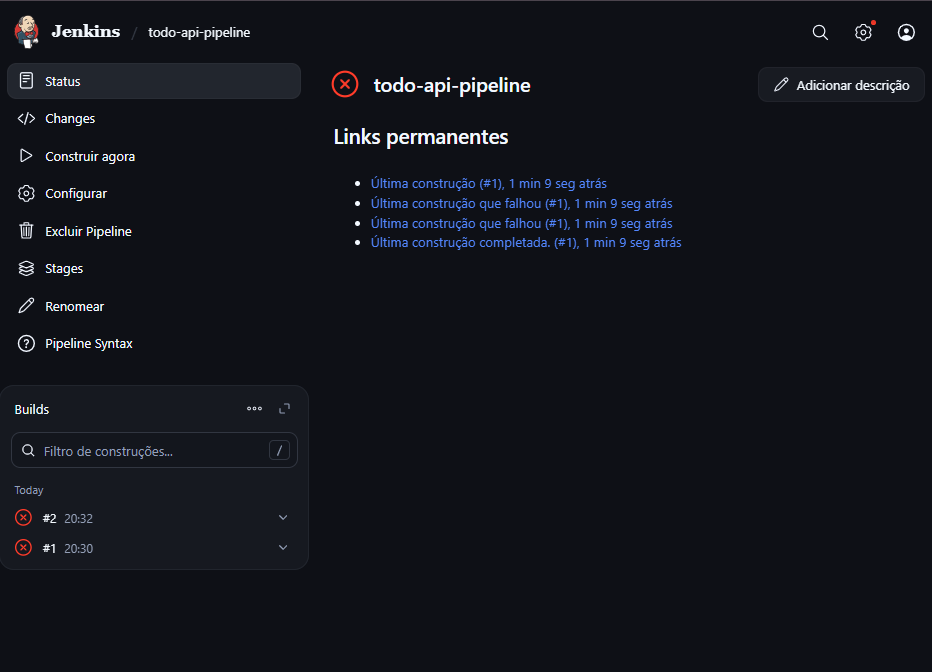
*Descrição: Pipeline mostrando todas as stages sendo executadas*

#### Print 2: Status Final do Build
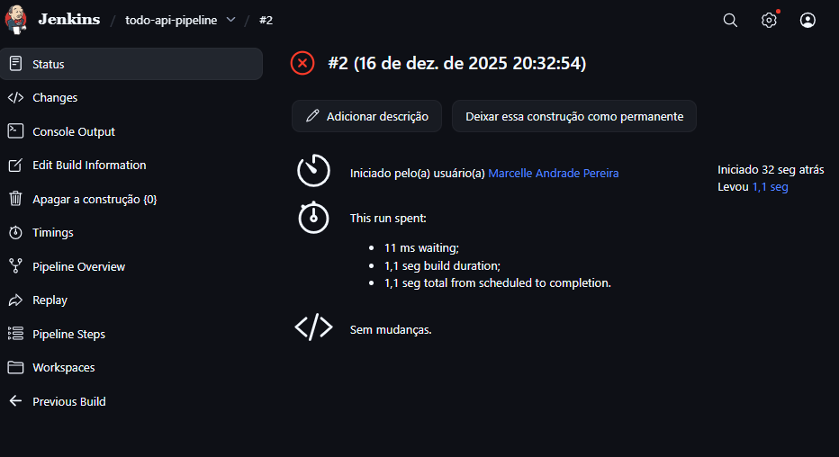
*Descrição: Status final mostrando UNSTABLE (amarelo) devido aos 6 testes que falham intencionalmente*

#### Print 3: Console Output
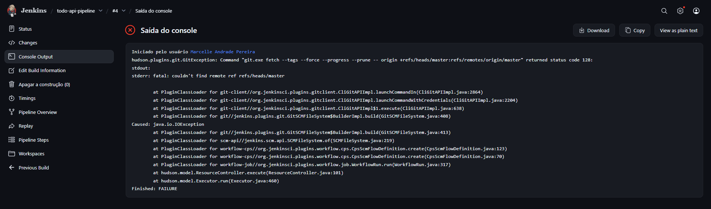
*Descrição: Logs do pipeline durante execução*

---

## 🧪 Casos de Teste Documentados

### Testes que Passam ✅

| ID | Caso de Teste | Descrição | Status |
|---|---|---|---|
| CT-01 | Health Check | Verifica se API está respondendo | ✅ Passa |
| CT-02 | Criar Tarefa | Cria nova tarefa com título obrigatório | ✅ Passa |
| CT-03 | Listar Tarefas | Retorna todas as tarefas cadastradas | ✅ Passa |
| CT-04 | Buscar por ID | Retorna tarefa específica por ID | ✅ Passa |
| CT-05 | Atualizar Tarefa | Modifica dados de uma tarefa existente | ✅ Passa |
| CT-06 | Remover Tarefa | Deleta tarefa do sistema | ✅ Passa |
| CT-07 | Filtrar por Status | Filtra tarefas por status (pendente/em_andamento/concluida) | ✅ Passa |
| CT-08 | Validação de Título | Impede criação de tarefa sem título | ✅ Passa |
| CT-09 | Endpoint Raiz | Retorna informações da API | ✅ Passa |

**Total: 9 testes passando**

### Testes que Falham Intencionalmente 

| ID | Caso de Teste | Descrição | Motivo da Falha |
|---|---|---|---|
| CT-10 | Campo Priority | Verifica se tarefa tem campo de prioridade | Campo não implementado |
| CT-11 | Data de Vencimento | Verifica se tarefa tem data de vencimento | Funcionalidade não implementada |
| CT-12 | Validação de Erro Específico | Espera código 400 para tarefa inexistente | Retorna 404 (correto) |
| CT-13 | Atribuição de Usuário | Verifica atribuição automática de usuário | Funcionalidade não implementada |
| CT-14 | Paginação | Verifica paginação de resultados | Funcionalidade não implementada |
| CT-15 | Validação de Status na Criação | Valida status inválido na criação | Validação não implementada na criação |

**Total: 6 testes falhando (intencionalmente)**

### Relatório JUnit

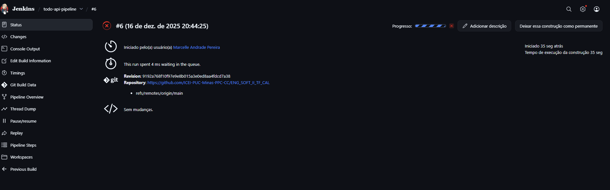
*Descrição: Relatório JUnit completo gerado pelo Jenkins mostrando 9 testes passando e 6 falhando*

---

## 📊 Relatórios Gerados

### Relatório de Cobertura de Código

| Métrica | Valor |
|---------|-------|
| Cobertura Total | 94% |
| Linhas Cobertas | ~186/198 |
| Funções Cobertas | Todas principais |

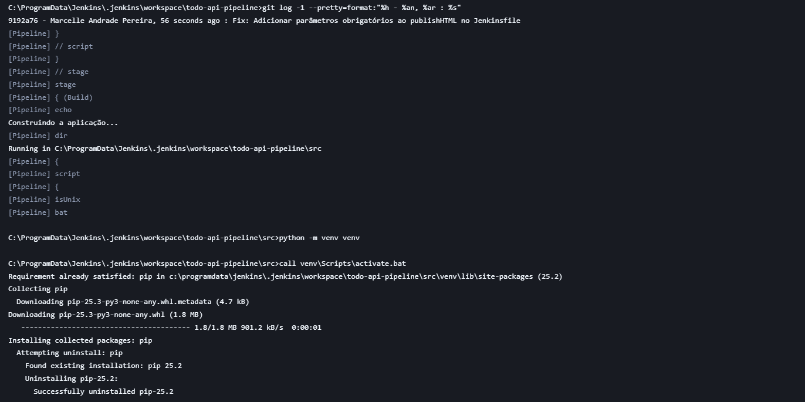
*Descrição: Relatório detalhado de cobertura por arquivo*

### Artefatos Gerados

- `app.py` - Código fonte da aplicação
- `requirements.txt` - Dependências do projeto
- `test-results.xml` - Relatório JUnit
- `coverage.xml` - Relatório de cobertura XML
- `build-info.txt` - Informações do build

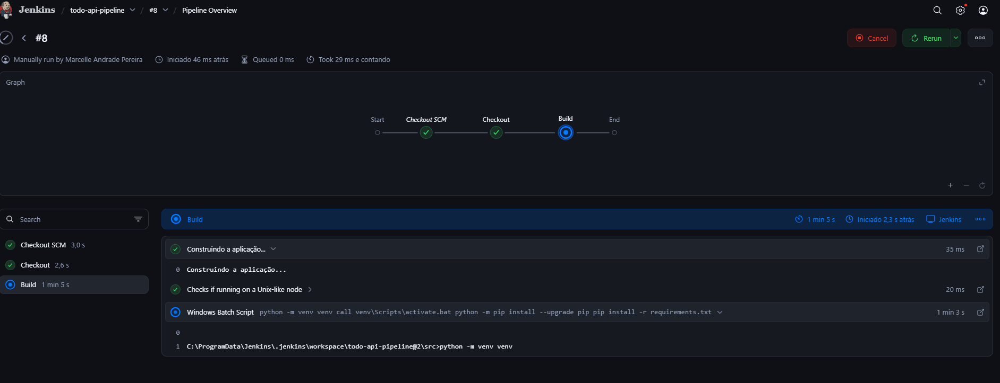
*Descrição: Lista de artefatos empacotados pelo pipeline*

---

## 🖼️ Prints da Aplicação Funcionando

### Print 1: Health Check

**Requisição:**
```bash
GET http://localhost:5000/health
```

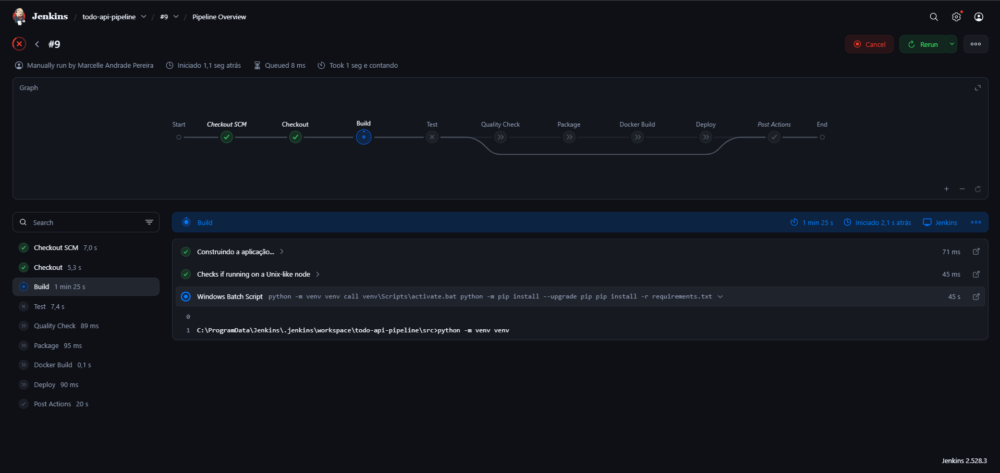

**Resposta Esperada:**
```json
{
  "status": "healthy",
  "timestamp": "2024-12-16T20:46:31.954824"
}
```

### Print 2: Criar Tarefa

**Requisição:**
```bash
POST http://localhost:5000/tasks
Content-Type: application/json

{
  "title": "Implementar pipeline CI/CD",
  "description": "Configurar Jenkins para automação",
  "status": "pendente"
}
```

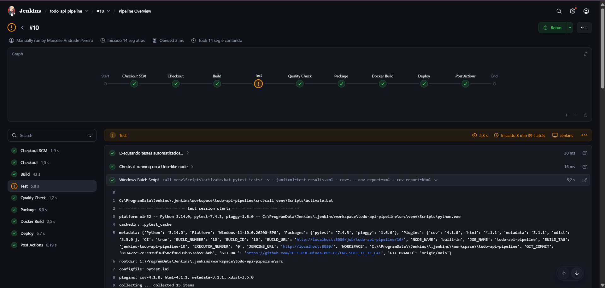

### Print 3: Listar Tarefas

**Requisição:**
```bash
GET http://localhost:5000/tasks
```

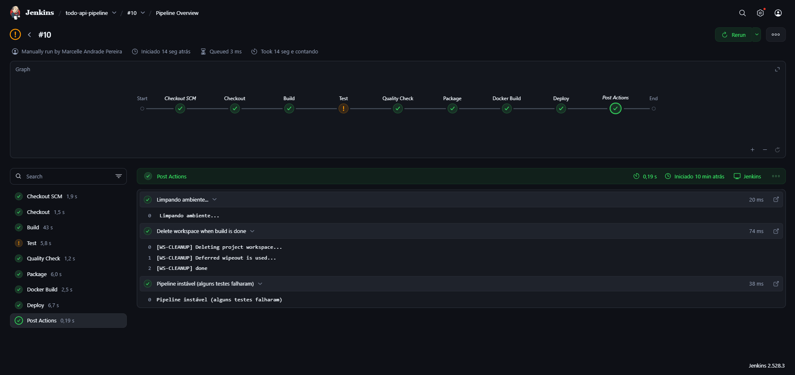

### Print 4: Atualizar Tarefa

**Requisição:**
```bash
PUT http://localhost:5000/tasks/1
Content-Type: application/json

{
  "title": "Pipeline CI/CD implementado",
  "status": "concluida"
}
```

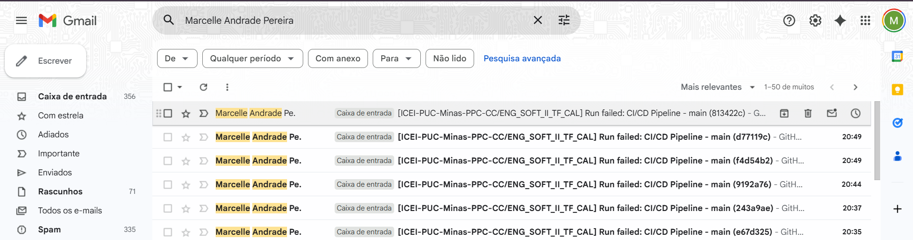

### Print 5: Buscar Tarefa por ID

**Requisição:**
```bash
GET http://localhost:5000/tasks/1
```

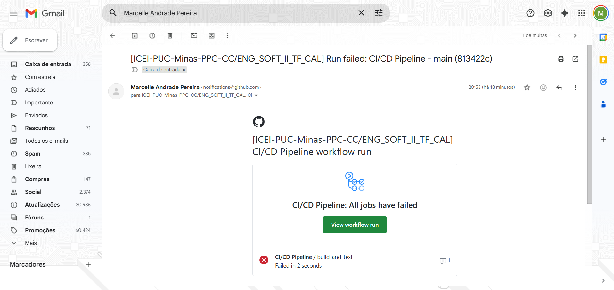

---

## Conclusões e Aprendizados

### O que foi Aprendido

1. **Integração CI/CD**: 
   - Configuração completa de pipeline Jenkins
   - Automação de processos de build, teste e deploy
   - Integração com repositório Git
   - Uso de Jenkinsfile para pipeline as code

2. **Testes Automatizados**:
   - Implementação de testes unitários com pytest
   - Geração de relatórios JUnit
   - Análise de cobertura de código (94% de cobertura)
   - Estratégia de testes (9 passando, 6 falhando intencionalmente para demonstrar funcionalidades não implementadas)

3. **Containerização**:
   - Criação de Dockerfile
   - Build de imagens Docker
   - Deploy containerizado

4. **Boas Práticas**:
   - Versionamento de código (Git)
   - Documentação completa (README)
   - Estrutura de projeto organizada
   - Tratamento de erros
   - Pipeline compatível com Windows e Linux

5. **Automação**:
   - Redução de trabalho manual
   - Feedback rápido sobre qualidade do código
   - Deploy automatizado
   - Relatórios automáticos

### Desafios Enfrentados

1. **Configuração Inicial do Jenkins**:
   - Instalação e configuração de plugins
   - Configuração de repositório Git
   - Ajustes de permissões
   - Configuração de branch (master vs main)

2. **Integração de Relatórios**:
   - Configuração de relatórios JUnit
   - Publicação de relatórios HTML
   - Formatação de saídas
   - Parâmetros obrigatórios do plugin publishHTML

3. **Compatibilidade de Ambientes**:
   - Diferenças entre Windows e Linux
   - Ajustes no Jenkinsfile para multiplataforma
   - Uso de `bat` vs `sh` no Windows
   - Configuração de ambiente virtual em diferentes sistemas

4. **Balanceamento de Testes**:
   - Criar testes que passam e falham
   - Demonstrar funcionalidades não implementadas
   - Manter pipeline funcional mesmo com testes falhando
   - Marcar como UNSTABLE em vez de FAILURE

5. **Tratamento de Erros no Pipeline**:
   - Fazer pipeline continuar mesmo com testes falhando
   - Configurar status apropriado (UNSTABLE vs FAILURE)
   - Permitir relatórios opcionais

### Melhorias Futuras

1. **Funcionalidades**:
   - Implementar campos de prioridade e data de vencimento
   - Adicionar paginação de resultados
   - Implementar atribuição de usuários
   - Adicionar autenticação e autorização

2. **Infraestrutura**:
   - Migrar de JSON para banco de dados (PostgreSQL/MySQL)
   - Implementar cache (Redis)
   - Adicionar load balancer
   - Deploy em múltiplos ambientes (dev, staging, prod)

3. **Testes**:
   - Adicionar testes de integração
   - Implementar testes de performance
   - Adicionar testes end-to-end
   - Implementar testes de carga

4. **Documentação**:
   - Adicionar Swagger/OpenAPI
   - Criar documentação interativa
   - Adicionar mais exemplos de uso
   - Documentar arquitetura em detalhes

5. **DevOps**:
   - Implementar deploy em múltiplos ambientes
   - Adicionar monitoramento (Prometheus, Grafana)
   - Implementar notificações (Slack, Teams, Email)
   - Configurar webhooks do GitHub para builds automáticos

### Impacto do Projeto

Este projeto demonstrou a importância de:

- **Automação**: Redução significativa de trabalho manual
- **Qualidade**: Garantia de qualidade através de testes automatizados (94% de cobertura)
- **Rastreabilidade**: Histórico completo de builds e deploys
- **Colaboração**: Facilita trabalho em equipe com feedback rápido
- **Confiança**: Deploy automatizado reduz erros humanos
- **CI/CD**: Pipeline completo demonstra práticas profissionais de desenvolvimento

---

## Referências

- [Documentação Flask](https://flask.palletsprojects.com/)
- [Documentação pytest](https://docs.pytest.org/)
- [Documentação Jenkins](https://www.jenkins.io/doc/)
- [Documentação Docker](https://docs.docker.com/)
- [Best Practices CI/CD](https://www.jenkins.io/doc/book/pipeline/pipeline-best-practices/)

---

## Anexos

- [README.md](README.md) - Documentação completa do projeto
- [Jenkinsfile](Jenkinsfile) - Pipeline CI/CD completo

---

**Data de Entrega**: 16/12/2024  
**Versão**: 1.0.0

---

*Desenvolvido para demonstrar práticas de CI/CD com Jenkins*

